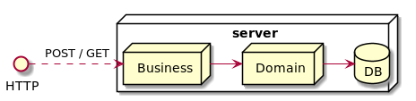

# Millenium Falcon Onboard Computer

Odds backend service for the falc'odds project.

The service is a Java EE & Quarkus framework application (JDK 8+ required).

## Database

The SQLite database can be created using sql scripts (under src/main/sql).

## Configuration

To configure the millenium falcon first, update the following file: millenium-falcon.json (under /src/main/resources).

Once built, the millenium-falcon.json file can also be uploaded at the root level of the falcodds-backend-1.0-SNAPSHOT-runner.jar archive.

## Build

To build the project with unit and integration tests, use:
```
./mvnw clean install
```

## Tests

To run the unit and integration tests, use:
```
./mvnw test
```

## Run

To run the odds backend service, use:
```
java -jar target/falcodds-backend-1.0-SNAPSHOT-runner.jar
```

## Ping

To check that the server is running, use: `curl -X GET http://localhost:8080/ping`.

This should display `falcodds` as a result.

## Structure

### Overview

