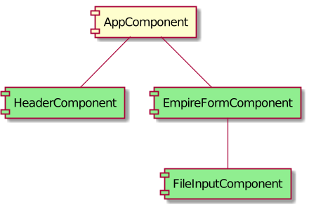

# C3PO

Front-end application for the falc'odds project.

The front-end is an Angular Universal application, served by a Node.js server (Node.js reduired).

## Build

To build the project, use:
```
npm install && npm run build:ssr
```

## Tests

To run the unit tests, use:
```
npm run test
```

To run the end to end tests, use:
```
npm run e2e
```

## Run

To run the front-end application, use:
```
npm run serve:ssr
```

## Structure

### Components Overview


